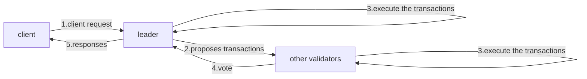

Libra protocol的逻辑数据模型

## Libra protocol简介

Libra区块链本质上是一个加密数据库，这个数据库是通过Libra protocol来维护的。所以Libra protocol是Libra区块链的核心。

Libra protocol的核心是账户，resources和module.

数据库主要存储可编程的resources账本，比如：Libra coin。这些resources是由定义的module来约定的，这些module也存储在数据库中。

resources属于账户，并通过公钥加密来认证。

帐户可以代表系统的直接最终用户，也可以代表实体，例如
代表用户的保管钱包。

帐户所有者通过sign transactions来使用帐户内的资源。

下面是一个client和validators使用libra protocol进行交互的例子：

具体分析一下每个步骤：

1. 验证器维护数据库并处理客户提交的交易，以将其包括在数据库中。
2. 验证者使用分布式共识协议来保证交易的提交。验证者不是不断轮动的。当验证人担任领导者时，它会提出交易，包括直接由客户提交给的他的交易以及通过其他验证者间接提交给其他验证者的交易。3. 所有验证程序执行交易并形成包含经过身份验证的数据结构:新的账本的历史记录。
4. 作为共识协议的一部分，验证者对该数据结构的验证者进行投票。
5. 作为在版本i上提交事务Ti的一部分，共识协议在版本i的数据库完整状态上输出一个签名-包括其整个历史记录来作为对来自客户端的查询的验证响应。

客户端可以向验证器发出查询，以从数据库读取数据。 由于数据库已通过身份验证，所以可以确保客户查询响应的准确性。 

此外，客户端可以选择通过同步验证者的交易记录来创建整个数据库的副本。

在创建副本时，客户端可以验证验证者是否正确执行交易，从而提高了系统的可靠性。 其他客户端可以从持有副本的客户端读取数据，方式与从验证程序读取客户端的方式相同。 为了简单起见，本文其余部分假设客户端直接查询验证器而不是副本。

## 逻辑数据模型

Libra区块链的所有数据都存储在一个单一的带版本的数据库中。数据库的版本号是由一个无符号的64-bit的整数来表示。这个整数是系统目前执行的交易个数。

假如在某个版本i，数据库包含元组(Ti,Oi, Si)，其中Ti表示交易，Oi表示交易的输出，Si表示版本的账本状态。

假如版本执行了一个Apply函数，那么这元组的意思就是：在账本状态Si-1执行了一个Ti交易，产生了一个输出Oi，和一个新的账本状态Si。

简单说就是如下的公式：
Apply(Si−1, Ti)->⟨Oi, Si⟩.

Libra协议使用Move语言来实现这个Apply功能，我们会在后面的文章中介绍。本章我们主要讲解版本数据库的交易和查询功能。

## 账本状态

账本状态是Libra区块链的基础，他包括每个用户在不同版本的状态。 每个验证者都可以获取最新的分布式账本本状态。

账本结构为键值存储，可将帐户地址键映射到帐户值。 账户
在分布账本状态下，是已发布的Move资源和模块的集合。 其中Move资源存储数据值，模块存储代码。 

在账本初始化的过程中，我们会创建一部分内置的账户。

**账户地址**

账号地址是一个256-bit的值。用户可以在本地创建公私钥对，然后将公钥的加密hash值作为账户的地址。这里要注意的是，这个账号地址只有发生交易的时候才会被创建（比如有Libra币被发送到这个地址的时候）。

账户创建之后，用户就可以使用私钥签名来使用这个账号来发送交易。用户可以在不更换账号地址的情况下，来更换或者轮循私钥。

如果你愿意，一个用户可以创建无限多个账户。

**Resource**

之前讲到了状态数据库是一个key-value形式的结构。key就是account的地址，value可以是resource也可以是module。

每一个resource都有一个由module声明的类型。resource的类型包含类型的名字和定义该类型的module的名字和地址。

假如我们有两个账户：Ox12和Ox34. 在Ox12中定义了一个module：Currency，在这个module中定义了一个type T。那么这个类型的名字就叫：Ox12.Currency.T。

这个类型的名字是唯一的，即使你在其他的账户中使用这个类型。比如我在Ox34中使用了这个类型，那么可以从Ox34中这样获得该resource： 0x34/resources/0x12.Currency.T.

这样设计的目的是让所有的资源类型都有一个统一的名字。

**Module**

Module主要是使用Move字节码来声明资源和procedures。和资源一样，Module也是通过账户地址来定位的，比如上面的Currency Module的标志就是：Ox12.Currency。 

在当前的Libra版本中，Module是不可更改的。一旦该Module在账户中声明之后，就不可以删除和更改，除非进行硬分叉。这个限制可能在未来的版本中发生改变。

## 交易

客户端通过提交Transaction来更新Libra区块链。通常来说Transaction包含一个交易脚本和交易脚本所需要的参数。

验证者使用当前账本状态和交易脚本的输入产生一个固定的输出结果。账本的状态只有当交易被共识提交之后，才会生效。

**交易输出**

执行一个交易Ti会产生一个新的账本状态Si，执行结果代码（执行是否成功），使用的gas，和event列表。

**事件**

事件列表是通过执行事务产生的一系列副作用。Move代码
在事件structure中出发时间。 每个事件都与唯一键相关联，
通过这个唯一键，可以确定发出事件的结构以及有效payload（有关事件的详细信息）。

一旦在共识协议中达成交易，交易产生的事件会被添加到账本历史中，并在相应的事件中提供成功执行的证明。 例如，一个
付款交易会产生一个事件，使接收者可以确认已付款收到并确认付款金额。

看起来好像Event是多余的，因为除了查询交易产生的事件以外，客户端还可以通过查询blockchain是否包含该交易来确定。

但是这很容易出错，因为包含Ti并不意味着成功执行（例如，
gas用完后可能会被打断）。 在交易可能失败的系统中，
event中的证据，不仅表明特定交易已执行，而且已成功完成
完成了预期的效果。

交易只能生成events,他们并不能读取event，这样的设计是为了让交易关注与最新的state信息，而不是历史的event信息。

## 账本历史

账本历史按顺序存储着提交和执行的交易及其相关联的事件。账本历史主要是用来保存记录，让大家知道最新的账本状态是怎么计算出来的。

和其他的区块链不一样的是，Libra账本历史并没有交易块的概念，在逻辑数据模型中，交易是顺序执行的，并不需要区分到底这个交易在哪个块里面。

虽然验证者不需要账本历史来产生新的账本状态，但是客户端可以使用这个账本历史来验证和查询相应的交易信息。

验证者通过查询历史账本来告诉客户端之前的账本状态，交易和相应的输出。

客户可以通过在在历史账本状态上重新执行特定的交易，通过验证输出的结果和执行后的账本状态来验证该交易是否被正确的执行。

