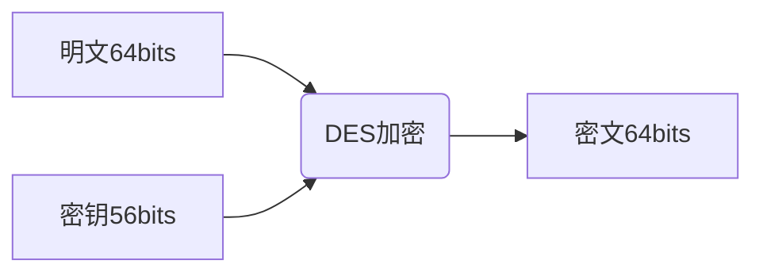
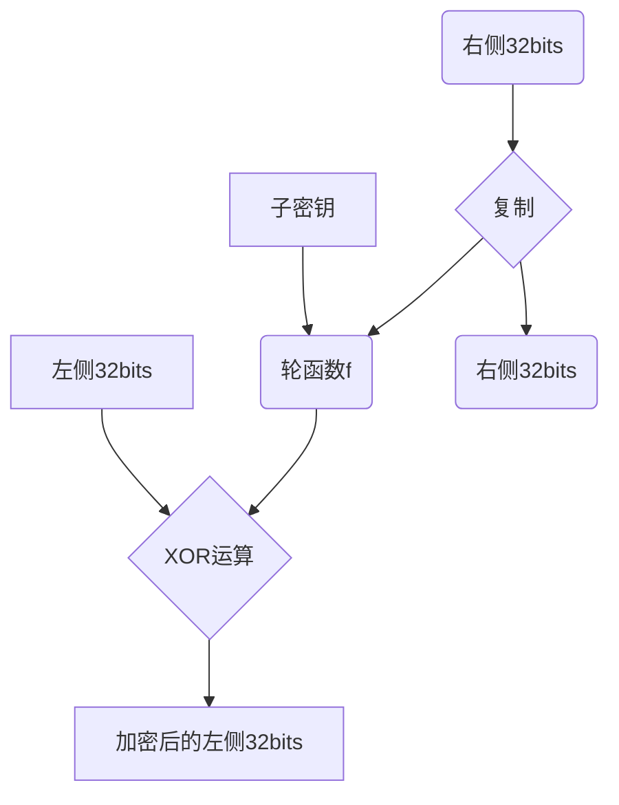
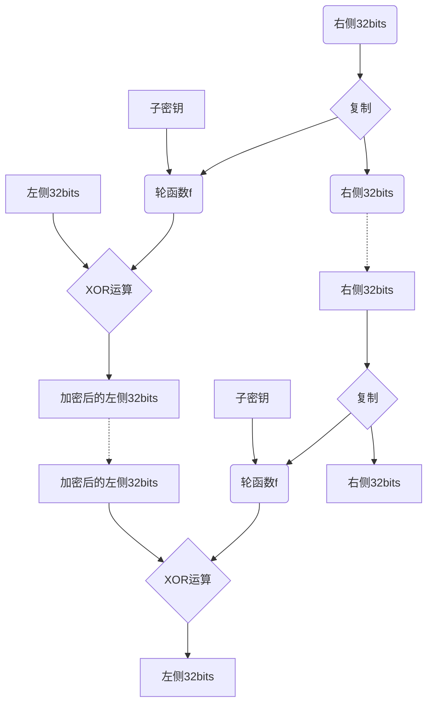
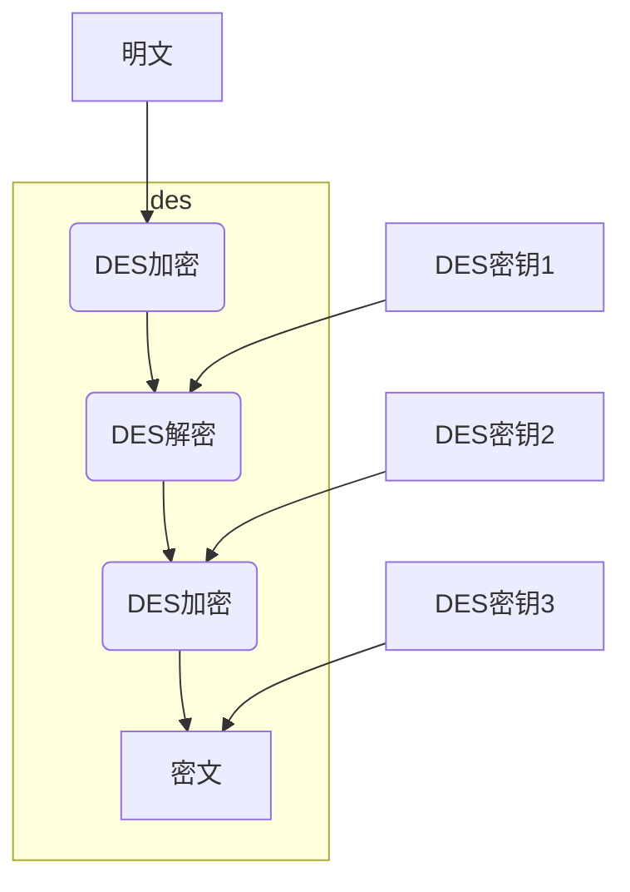

# 8. DES

##  什么是DES

DES全称叫(Data Encryption Standard), 是1977年美国联邦信息处理标准（FIPS）中所采用的一种对称加密算法。

DES之前一直使用很普遍，但是随着计算机的进步，现在DES已经可以被暴力破解了，处理历史的原因外，我们不再建议使用DES算法。

## DES的加密解密

DES的密钥长度是64比特，也就是8个字节。但是DES每隔7
比特会设置一个错误校验位，所以真正的密钥长度是56比特。

因为DES的长度是64比特，他每次只能将长度为64比特的原文进行加密，如果原文长于64比特的话，需要多次分组进行加密，这64比特的单位也叫做分组。

分组密码（block cipher）就是以分组为单位进行加密的算法。

其加密解密的示意图如下：

**DES加密**

**DES解密**

## DES工作原理

DES是由Horst Feistel设计的，因此也称作Feistel网络。

Feistel网络，加密的各个步骤称为轮（round)，整个加密过程就是进行若干轮的循环。

下图展示了DES中的一轮加密过程：

由上图我们可以看到，在每一轮的操作中，输入的数据被分成左右两部分，中间的子密钥是指本轮加密所使用的密钥。在Feistel网络中，每一轮都使用不同的密钥，该密钥只是一个局部密钥，所以被称为子密钥。

其运算步骤如下：

1. 将输入的数据分成左右两部分
2. 将输入的右边直接发送到输出的右边
3. 将输入的右边发送到轮函数f
4. 轮函数根据右侧数据和子密钥计算出一个随机数
5. 将4得到的随机数和左侧数据进行XOR运算，将运算后的结果作为加密的左侧。

我们可以看到这一轮操作，只加密了左侧数据，右侧的没有加密，然后我们可以交换左右两侧的数据，再来一轮加密。这样右侧的数据也被加密了。

**怎么解密**

上面我们讲到了加密的过程，接下来我们再看一下解密的过程。

在一次性密码本中，我们讲到了XOR的特性，即：

A XOR B = C
C XOR B = A

按照这样的特性，我们只需要将加密后的结果跟步骤4中计算出来的随机数再做一次XOR运算即可还原加密前的数据。

如下图所示：

## Feistel 网络的特性

我们可以看到Feistel网络有如下几个特性：

1. Feistel网络的轮数可以任意增加。不论多少轮都可以正常解密。
2. 解密与轮函数f无关，轮函数f也不需要有逆函数。轮函数可以设计得足够复制。
3. 加密和解密可以使用完全相同的结构来实现。从上面我们讲到的可以看到，加密和解密其实是没有什么区别的。

## 三重DES

因为DES现在可以很容易被暴力破解，所以开发出了三重DES算法。

三重DES就是将DES的算法重复三次得到的一种密码算法。其加密机制如下：

由上图所示，3重DES的密钥长度是3*64bits。

并且是 加密->解密->加密的过程。 在两个加密中加入了一个解密过程。

这个是为了兼容普通的DES算法，如果将3个DES密钥保持一致，这样3重DES算法等于普通的DES算法了。

更多教程请参考 [flydean的博客](http://www.flydean.com/des/)
